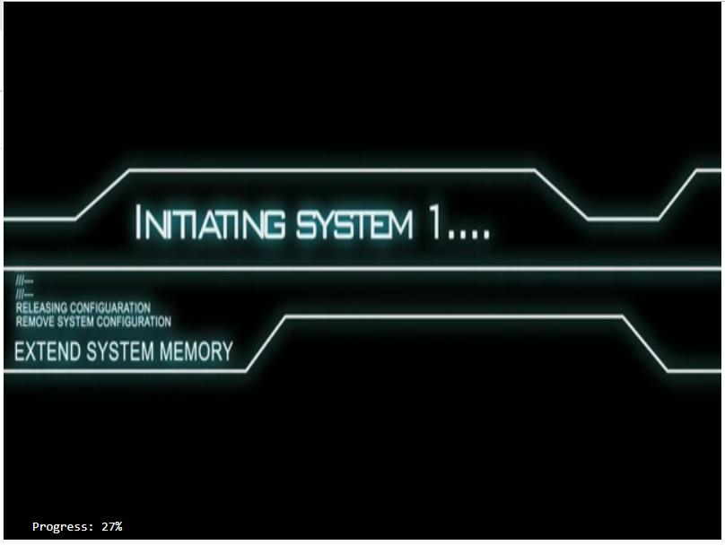

# PhaserGame Ghostbusters

Presentación del Proyecto realizado por Raúl Moreno

El juego consta de un jugador estático situado en el centro del canvas. Aparecen grupos de 10 fantasmas con posición aleatoria que van acercándose al jugador.
Son 10 rondas y según avanza el numero de ronda la velocidad de los fantasmas aumenta. Al llegar a la ronda 10 aparece el boss que comienza con 60 vidas y para ganar tienes que bajar su vida a 0.

## Pantalla de inicio

Tenemos una pantalla inicial con el progreso de carga abajo a la izquierda.

## Pantalla de juego

Tenemos en la parte de arriba los textos que muestran la puntuación, la vida del jugador, enemigos derrotados y vida del boss que se activa al nivel 10.

## Pantalla Game Over

Si la vida del jugador llega a 0 termina el juego.

## Nivel 10

Al llegar a la ronda 10 aparece el boss.

## Texto final de ganador

Si llegas a derrotar al boss el juego termina.

P.D. Los Sprite de los fantasma y Boss hechos es cosecha propia :)
