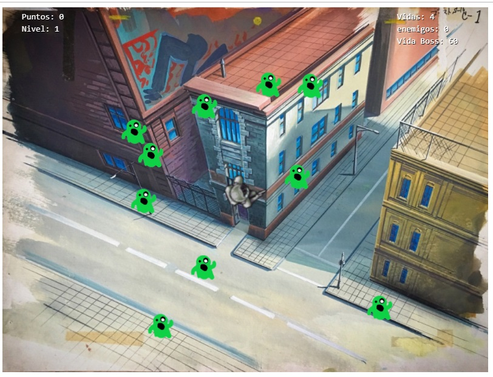

# PhaserGame Ghostbusters

Presentación del Proyecto realizado por Raúl Moreno

El juego consiste en un jugador estatico en el centro del canvas, aparecen fantasmas con posición aleatoria y van acercadose al jugador.
Son 10 rondas que cada ronda la velocidad de los fantasmas aumenta, al llegar a la ronda 10 aparece el boss, para ganar tienes que bajar su vida a 0.

## Pagina de inicio

Tenemos una pagina de carga con el progreso de carga abajo a la izquierda.

## Pantalla de juego

Tenemos en la parte ded arriba los textos que muestra, la puntuación, la vida del jugador, enemigos matados y vida del boss que se activa al nivel 10.

## Pantalla Game Over

Si la vida del jugador llega a 0 termina el juego.

## Nivel 10

Al llegar a la ronda 10 aparece el boss.

## Texto final de ganador

Si llegas a matar al boss el juego termina.

